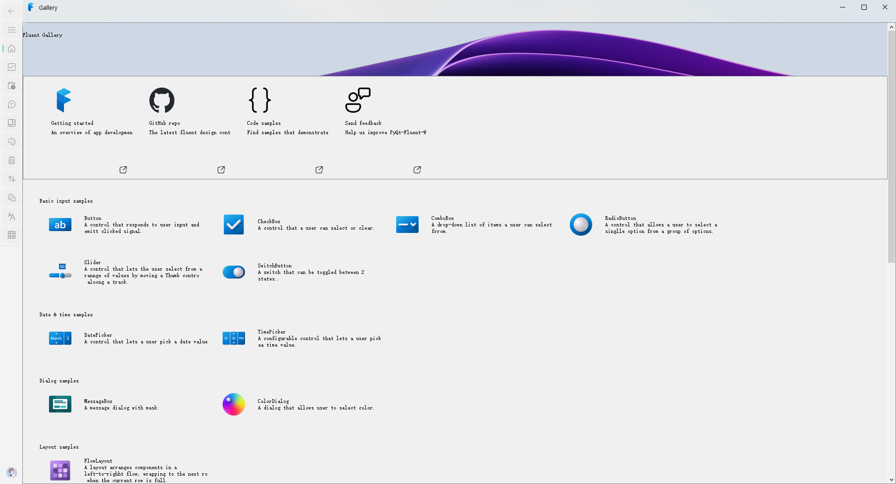

# 说明

原作是 python 库，传送门[GitHub - zhiyiYo/PyQt-Fluent-Widgets: A fluent design widgets library based on PyQt5](https://github.com/zhiyiYo/PyQt-Fluent-Widgets)

当前分支`444f2fe980ac472449be20fe24a185d251942dc3`

未完待续...

# 截图

1. gallery

